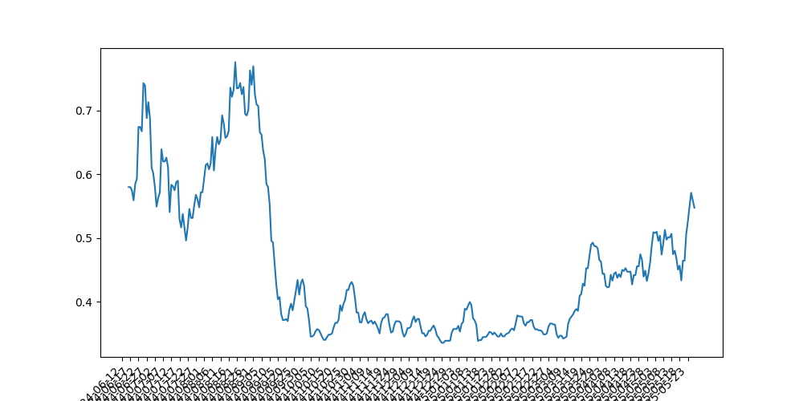

# RunningVolume_Injury

<a target="_blank" href="https://cookiecutter-data-science.drivendata.org/">
    
</a>

Predicting individualised injury risk trends in runners based on user activity data


## Project scope

When people get into running at various levels, they will typically encounter several pieces of advice for staying injury free, the main one being load management -load being the total strain put on the body, usually measured as a combination of how far you run X how fast you run. One of the golden rules for load management is to ‘increase volume(total distance covered) by 10% each week to avoid injury’ and this is generally taken as gospel, and you'll see it repeated in lots of different places. 
Currently recovering from my own injury, my perspective as a data scientist has led me to ask ‘what do the data say?’ What is the baseline injury rate for runners maintaining volume/intensity, and what is the relative injury rate for various increases in volume? Some research has been done on this but it is far from conclusive. I hope to help users understand if their recent training puts them at a higher risk of injury.

Using machine learning, and a dataset detailing training and injuries for a group of competitive medium to long distance runners, I have created a model that predicts relative risk of injury over time based on various training details like overall distance, and distance in different heart rate zones(higher zone => faster running). 
To make these predicitions available for users, I have created a pipeline so that users can login with their Garmin connect details and their activity data will be extracted, transformed, and loaded into the model so that it can make predictions about their injury risk and generate visualisations of their risk trends.

## 🧭 Project Workflow


## Project Demonstration

A video of me giving a demo of an earlier version of the project and discussing some of the results can be found here: https://www.loom.com/share/a783d406943e4f20a68f1a5d8d3b8eca?sid=c80f4b59-c03a-420e-bf74-750eee413210

## Example Visualisation
The following image shows that the data shows a clear spike in risk correlating directly with the time of my actual injury on the first week of september 2024, demonstrating that the model was able to account for my injury risk better than the 10% weekly mileage increase rule that I had been adhering to, validating that my model would have helped me to avoid injury.




## Installation

If you wish to run this project locally, you can install it as a package directly from GitHub using `pip`:

```bash
pip install git+https://github.com/milooranm/RunningVolume_Injury.git
```

## References

Paper that makes original predictions on the dataset
https://pure.rug.nl/ws/portalfiles/portal/183763727/_15550273_International_Journal_of_Sports_Physiology_and_Performance_Injury_Prediction_in_Competitive_Runners_With_Machine_Learning.pdf

Python API wrapper for Garmin Connect adapted from https://github.com/cyberjunky/python-garminconnect

## Project Organization

```
├── LICENSE                              <- Open-source license
├── README.md                            <- Top-level README for developers
├── pyproject.toml                       <- Project config and package metadata for Runningprojectmodule
├── poetry.lock                          <- Locked dependency versions
├── requirements.txt                     <- Requirements file for reproducing the analysis environment
├── setup.cfg                            <- Configuration file for flake8
│
├── Runningprojectmodule/                <- Main source package
│   ├── __init__.py                      <- Makes Runningprojectmodule a Python package
│   ├── APIcall_v2.py                    <- Garmin Connect API wrapper
│   ├── config.py                        <- Stores useful variables and configuration
│   ├── data_extraction.py               <- Scripts to extract and load data from the API
│   ├── dataset.py                       <- Scripts to download or generate datasets
│   ├── features.py                      <- Code to create features for modeling
│   ├── plots.py                         <- Code to create visualizations
│   ├── project_instance.py              <- End-to-end pipeline entry point
│
├── models/                              <- Trained and serialized models
│   ├── logistic_model.pkl
│   ├── mvp1_logistic_model.pkl
│   ├── mvp2best_logistic_model.pkl
│   └── xgboost_untuned.py
│
├── notebooks/                           <- Jupyter notebooks for exploration and training
│   ├── Early look at data.ipynb
│   ├── Generate_training_review.ipynb
│   ├── Tuned_LogReg_model.ipynb
│   ├── api_data_extraction.ipynb
│   └── experimentation/
│       ├── logR.ipynb
│       ├── multi_cell_train_XGBC.ipynb
│       └── tune_XGBC.ipynb
│
├── MVP2 notebooks/                      <- Notebooks and scripts for MVP2 iteration
│   ├── APIcall_v3.py
│   ├── MVP2 EDA.ipynb
│   ├── MVP2_data_extraction_test.ipynb
│   ├── MVP2log_reg.ipynb
│   ├── Neural_network _implementation.ipynb
│   ├── apicall_input.py
│   ├── data_extraction_v2.py
│   ├── fast_inst.py
│   ├── fastapi.ipynb
│   ├── mvp2LogRegTest.ipynb
│   ├── requirements.txt
│   └── trial_fastapi.py
│
├── Render/                              <- Files for Render deployment
│   ├── apicall_input.py
│   ├── data_extraction_v2.py
│   ├── fast_inst.py
│   ├── mvp2best_logistic_model.pkl
│   └── requirements.txt
│
├── references/                          <- Reference code, data dictionaries, and explanatory materials
│   ├── APIcall.py
│   ├── APIcall_v2.py
│   ├── GarminAPIpull.py
│   ├── injured_running.jpg
│   ├── reference_code_Lovdal.ipynb
|   ├── rolling_mean_plot.png
|   ├── user activity_data_with_predictions.csv 
│   └── workflow.svg
│
└── tests/                               <- Unit tests
    ├── test_apicall_input.py
    └── test_data_extraction.py
```

--------
